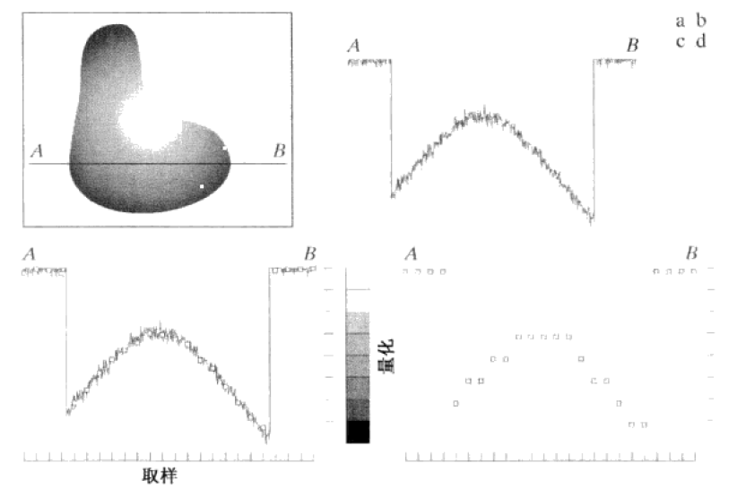

视觉感知要素：
===

	#：数字图像处理建立在数学和概率公式上

图像取样与量化：
---
	前面多种获取图像的方法的目的就是从感知的数据生成数字图像。
	1. 基本概念：一幅图像的x和y坐标可能都是连续的，为了将图像转成数字形式，必须在坐标上和幅度上进行取样操作。
	对坐标值进行数字化称为取样，对幅值数字化称为量化。
	

	1. 图(b)的一维函数，是从图(a)中沿着AB的连续图像幅度值（灰度级）的曲线
	2. 随机变化是由于图像噪声引起
	3. 沿线段AB等间隔取样

	空间取样：通过选择各个机械增量的数量并在取样处激活传感器来搜集数据完成的

数字图像表示：
---
	令f(s,t)表示一幅具有两个连续变量s和t的连续图像函数，通过取样量化，将函数转为数字图像。
	由一幅图像的坐标张成的实平面部分称为空间域，x和y称为空间变量和空间坐标。
	
	下图中展示了三种基本的方法表示f(x,y)

	
	结论：
		1. 图像显示允许我们快速观察结果
		2. 数值阵列用于处理和算法开发
		3. 以正式的数学术语表达取样和量化的过程，令Z和R分别表示整数集和实数集，取样处理可以看做把xy平面网格化，
		   网格中的每个单元的中心的坐标是笛卡尔积中的一对元素。如果(x,y)是笛卡尔积中的整数，
		   且f是把灰度值赋给每个特定坐标对(x,y)的一个函数，则f(x,y)是一幅图像。
	#注意：
		1. 数字图像的原点位于左上角，正x轴向下延伸，正y轴向右延伸
		2. 数字化过程中，灰度级数典型地取2的整数次幂
		
	1. 图像系统的动态范围定义为系统中最大可度量灰度与最小检测灰度之比。上限取决于饱和度，下限取决于噪声。
	   （动态范围由系统能表示的最低和最高灰度级来确定）
	2. 对比度：一幅图像中最高和最低灰度级的灰度差为对比度

空间和灰度分辨率：
---
	一、空间分辨率	
		空间分辨率是图像中可辨别的最小细节的度量（每单位距离线对数，每单位距离点数是通用的度量）
		1. 图像分辨率的广泛定义：每单位距离可分辨的最大线对数
		2. 每单位距离点数是印刷和出版业中的常用的图像分辨率的度量
		3. 美国使用每英寸点数(dpi)
		#注意：
			1. 空间分辨率的度量必须针对空间单位来规定
			2. 256级 = 8 比特
	二、灰度分辨率
		灰度分辨率指在灰度级中可分辨的最小变化，灰度分辨率指的是用于量化灰度的比特数

图像内插
---
	1. 内插是诸如放大、收缩、旋转和几何校正等任务中广泛应用的基本工具。
	2. 图像的重取样方法：利用内插调整图像的大小
	3. 内插是用已知数据来估计未知位置的数值的处理

	*. 最近邻内插法：把原图像中最近邻的灰度赋给了每个新位置（不常用）
	*. 双线性内插：用4个最近邻去估计给定位置的灰度，令(x,y)为我们想要赋灰度值的位置,v(x,y)为灰度值
	   v(x,y) = ax + by + cxy + d
 	   4个系数由4个用(x,y)点最近邻点写出的位置方程确定
	*. 双三次内插：包含16个最近邻点（商业图像编辑程序的标准内插方法）

像素间的一些基本关系
===
	一、相邻像素
		像素p的4个水平和垂直的相邻像素，坐标：(x+1,y),(x-1,y),(x,y+1),(x,y-1)，p的4邻域，N4(p)
		p的4个对角相邻像素的坐标：(x+1,y+1),(x+1,y-1),(x-1,y+1),(x-1,y-1)，上述8个点称为p的8邻域,N8(p)

        二、邻接性、连通性、区域和边界
		令V是用于定义邻接性的灰度值的集合。在二值图像中，如果把具有1值得像素归诸于临界像素，则V={1}。
		在灰度值范围为0-255的邻接像素中，集合V是这256个值的子集。

		a) 4邻接：如果q在集合N4(p)中，则具有 *** V中数值 *** 的两个像素p和q是4邻接的。
		b) 8邻接：如果q在集合N8(p)中，则具有 *** V中数值 *** 的两个像素p和q是8邻接的。
		c）m邻接（混合邻接）：q在集合N4(p)或集合ND(p)中，且N4(p)∩ND(p)中没有来自V中数值的像素
                混合邻接的作用：8邻接的改进，消除采用8邻接时产生的二义性。**见图**
 ##图片待插入
 =======

        三、通路
                1. 从一个像素到另一个像素的通路（曲线）是特定的像素序列。n是通路的长度，如果首尾相等，则通路是闭合通路。
                2. 坐标为(x0,y0),(x1,y1),(x2,y2)...,(xn,yn)。其中(x0,y0)=(x,y),(xn,yn)=(s,t)。且(xi,yi),(xi-1,yi-1)。
                3. 令S是图像中的一个像素子集，如果S的全部像素之间存在一个通路，则可以说两个像素p和q在S中是连通的。对于S
                中的任何像素p,S中连通到该像素的像素集称为S的连通分量。如果S仅有一个连通分量，则集合S称为连通集。
                4. 令R是图像中的一个像素子集。如果R是连通集，称R为一个区域。若存在两个区域，如果Ri与Rj联合形成一个连通集，
                则称为邻接区域。不邻接的区域称为不连接区域。
                5. 假设一幅图像包含K个不连接的区域，即Rk,k=1,2,3,4...，K，并且都不接触图像的边界。令Ru代表所有K个区域的
                并集，并且令(Ru)c代表其补集。Ru中的所有点为图像的前景，(Ru)c中的所有点称为图像的背景。
                6. 区域的边界与R的补集中的点邻近（一个区域的边界是该区域中至少一个背景邻点的像素集合）。
 （此处有疑问）
 ===
        疑问：
                1. 指定用于定义邻接的连通性。如果图中被圈出的点在区域及其背景间使用4连通，就不是1值边界区域的成员。
                2. 边界不太懂
        四、边界
                1. 内边界
                2. 外边界：对应于背景边界
        五、距离度量
                1. 对于坐标为(x,y),(s,t),(v,w)的像素p,q,z，如果：
                   1. D(p,q) >= 0 [D(p,q) = 0,当且仅当p=q]
                   2. D(p,q) = D(q,p)
                   3. D(p,z) <= D(p,q) + D(q,z)
                   称D是距离函数或度量
        六、距离
                1. 欧式距离（圆）
                2. 城市街区距离（菱形）
                   D4(p,q)=|x-s|+|y-t|
                3. 棋盘距离（方形）
                   D8(p,q)=max(|x-s|,|y-t|)
                4. 若考虑m邻接，则两点间的Dm距离用点间的最短通路定义。两个像素间的距离将依赖于沿通路的像素值及其邻点值

数字图像处理中所用数学工具的介绍
===

阵列与矩阵操作
---
        1. 阵列操作贯穿全书，一幅图像求幂，意味着每个像素均进行求幂操作；当谈到一幅图像除以另一个图像时，意味着在相应的
        像素对之间进行相除

线性与非线性操作
---
        1. 图像处理方法的最重要分类之一是线性是还是非线性的。考虑一般的算子H，该算子给定输入图像f(x,y),产生一幅图像的输
        出g(x,y)即 H[f(x,y)]=g(x,y)
        2. H[aifi(x,y) + ajfj(x,y)] = aiH[fi(x,y)] + ajH[fj(x,y)] = aigi(x,y) + ajgj(x,y) (ai,aj,fi(x,y),fj(x,y)分别是任
        意常数和图像)
                特性1. 两个输入的和与分别对输入进行操作然后求和得到的结果相同，加性
                特性2. 输入乘以常数的线性操作的输出与乘以该常数的原始输入的操作的输出是相同的，同质性
        3. 最大值操作，在图像中寻找像素的最大值。（如何证明通常求最大值的操作是非线性的案例见书42页）
        
 算术操作
 ---
        1. 图像间的算术操作是阵列操作
        例题：（暂时无法理解）
                1. 针对降噪的带噪图像相加（平均）
                2. 增强差别的图像相减
                3. 使用图像相乘和相除来校正阴影
        2. 给定一幅图像f，保证图像间算术操作的整个值域落在某个固定比特数的方法如下
                首先：fm = f - min(f)，生成其最小值为0的一幅图像
                然后：fs = K[fm/max(fm)]，处理8比特图像时，置K=255
                
集合和逻辑操作
===

基本集合操作
---
        1. 集合用于图像处理的一种方法是令集合的元素为图像中表示区域（物体）的像素的坐标（整数对）

逻辑操作
---
        1. XOR异或：属于A或B，但不是A与B的交集

模糊集合
---

空间操作
===
        单像素操作、邻域操作、几何空间变换
        1. 单像素操作：以灰度为基础改变单个像素的值 s=T(z)
        2. 邻域操作：令Sxy代表图像f中以任意一点(x,y)为中心的一个邻域的坐标集。邻域处理在图像g中的相同坐标处生成一个相应
        的像素，该像素的值由输入图像中坐标在Sxy内的像素经指定操作决定
        3. 几何空间变换和图像配准：几何变换改进图像中像素间的空间关系（橡皮膜变换）
                1. 坐标的空间变换：最常用的空间坐标转换之一是仿射变换（表格见书51页）
                                                 [t11 t12 0]        
                        [ x y 1]=[v w 1]T=[v w 1]|t21 t22 0|
                                                 [t31 t32 0]     

                2. 灰度内插，即对空间变换后的像素赋灰度值。1完成像素的重新定位，为了完成该处理，还必须对这些新位置赋灰度
                值，使用灰度内插即可完成。
                3. 实际上按照两种基本方法使用1的公式
                        1. 前向映射：在每个位置直接计算出图像中相应像素的空间位置（x，y）
                        2. 反向映射
                4. 图像配准：用于对齐多幅相同场景的图像
                        1. 约束点（控制点）
                        2. 估计变换函数（例4对相应的约束点）
                                x = c1v + c2w + c3vw + c4
                                y = c5v + c6w + c7vw + c8
        4. 向量与矩阵操作：典型领域多光谱图像处理。每个RGB图像的每一个像素有三个分量
                    [z1]，红    
                z = |z2|，绿
                    [z3]，蓝
        5. 一旦像素被定义为向量，就可以使用向量矩阵理论。
                例1：像素向量z和一个任意点a在n维空间的欧式距离D用向量积定义
                        D(z,a)..... 也称向量范数||z-a||
                例2：w = A(z-a)
图像变换
===
        1. 有些情况下，通过变换输入图像来表达图像处理任务，在变换域执行指定的任务，之后再用反变换返回到空间域会更好
        2. 表示为T(u,v)的二维线性变换是一类特别重要的变换

### 待插入公式）

        3. 如果r(x,y,u,v)=r1(x,u)r2(y,v)则正向变换核是可分的。如果r1(x,y)等于r2(x,y),则变换核是对称的，从而有r(x,y,u,v)=r1(x,u)r2(y,v)

傅里叶和矩阵有点不懂
====

概率方法
===
        随机变量z关于均值的第n阶矩定义

